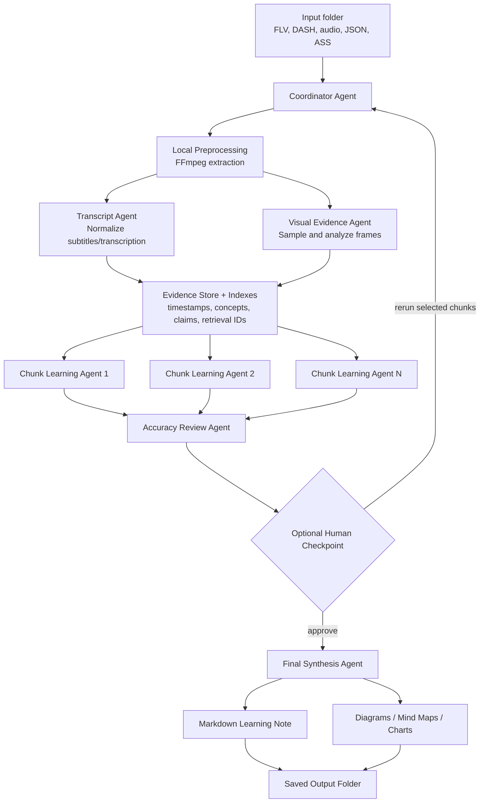

# Multi-Agent Local Video Learning Helper Plan

## Summary

Build a local-first CLI tool that processes one downloaded video folder into one detailed Markdown learning note. The system will use a **Coordinator Agent** plus true AI sub-agents to avoid context-window overload, improve accuracy, and keep the workflow extensible.

Core verdict:

- **Executable:** Yes, using FFmpeg for local media extraction and OpenAI for transcription, visual reasoning, and synthesis.
- **Cost-controllable:** Yes, with analysis modes, caching, chunking, and optional checkpoints.
- **Scalable later:** Yes, if agents communicate through structured artifacts, indexes, and retrieved evidence instead of one giant prompt.

## Key Architecture

- CLI interface:
  - `process <folder>`
  - analysis modes: `standard`, `visual`, `deep`
  - default output: Markdown learning notes
  - optional checkpoint before final synthesis
- Local preprocessing:
  - detect FLV/DASH video, DASH audio, JSON transcript, ASS subtitle files;
  - use FFmpeg to extract metadata, audio, and sampled frames;
  - cache extracted artifacts to avoid repeated cloud calls.
- Multi-agent workflow:
  - **Coordinator Agent:** plans the run, splits content into chunks, dispatches sub-agents, tracks evidence, and manages final synthesis.
  - **Transcript Agent:** normalizes JSON/ASS/transcribed audio into timestamped text chunks.
  - **Visual Evidence Agent:** analyzes key frames or dense frame samples depending on mode.
  - **Chunk Learning Agent:** summarizes each chunk into concepts, examples, claims, timestamps, and uncertainties.
  - **Accuracy Review Agent:** checks chunk outputs for missing context, contradictions, weak evidence, and hallucination risk.
  - **Final Synthesis Agent:** combines approved chunk summaries into the final Markdown learning note and generates learning-friendly visual structures such as Mermaid diagrams, mind maps, concept maps, process flows, or comparison charts.
- Context-window strategy:
  - split long videos into timestamped chunks;
  - create hierarchical summaries: chunk -> section -> full note;
  - preserve key claims, examples, uncertainties, timestamps, and retrieval IDs for final synthesis;
  - use indexes to locate source evidence without loading all raw details into context;
  - never pass the full transcript, all frames, and all prior notes into one prompt.

## RAG And Indexing Strategy

- Use Retrieval Augmented Generation as a support mechanism, not as the whole product.
- Store extracted artifacts in a local evidence store:
  - transcript chunks;
  - subtitle segments;
  - frame descriptions;
  - metadata;
  - chunk summaries;
  - timestamped claims;
  - generated diagrams and final notes.
- Build lightweight indexes over those artifacts:
  - timestamp index for navigating video sections;
  - concept index for finding repeated topics and definitions;
  - evidence index for linking claims back to transcript/frame sources;
  - optional vector index for semantic retrieval when exact keyword search is not enough.
- Use retrieval when an agent needs detail:
  - Chunk Learning Agent retrieves nearby transcript/frame evidence for its assigned segment.
  - Accuracy Review Agent retrieves source evidence to check claims.
  - Final Synthesis Agent retrieves only the most relevant evidence for each section of the final note.
- Keep v1 practical:
  - start with simple local files plus structured JSON indexes;
  - add vector search only after the basic pipeline proves useful;
  - treat RAG as an accuracy and context-window tool, not as a replacement for careful chunking and hierarchical summaries.

## Agent Flow Diagram

## Agent Workflow

- Run sub-agents on chunks in parallel for efficiency.
- Use structured outputs for every sub-agent:
  - source range;
  - key concepts;
  - concrete examples;
  - timestamped claims;
  - visual observations if relevant;
  - uncertainty flags;
  - recommended follow-up checks.
- Add an optional human checkpoint after chunk analysis:
  - user can inspect outline, chunk summaries, and uncertainty flags;
  - user can continue, rerun selected chunks, or switch to deeper visual mode.
- Final Markdown note should include:
  - source summary;
  - detailed concept map;
  - beginner-friendly explanations;
  - examples from the video;
  - timestamp references;
  - Mermaid-compatible diagrams, mind maps, or charts where they improve learning;
  - important caveats or confusing parts;
  - review questions;
  - suggested next learning actions.

## Test Plan

- Process a folder with FLV video plus JSON transcript.
- Process DASH video/audio plus ASS subtitles.
- Process video/audio with no transcript and require transcription.
- Compare `standard`, `visual`, and `deep` modes on the same video.
- Verify parallel chunk processing preserves correct timestamp order.
- Verify final notes do not invent unsupported claims.
- Verify optional checkpoint can catch bad chunk summaries before final synthesis.
- Verify reruns use cached transcript, frame, and model artifacts.
- Verify diagrams render in Markdown viewers that support Mermaid.
- Verify retrieval/index lookup can recover supporting evidence for final-note claims.

## Assumptions

- First version is for personal local use.
- Accuracy is prioritized over speed and minimal cost.
- Sub-agents are true AI agents with bounded tasks, not just helper functions.
- Parallel chunk processing is required for v1.
- Human review checkpoint is optional, not mandatory.
- Evidence preservation should focus on key claims plus timestamps.
- FFmpeg is acceptable as a local dependency.
- OpenAI is the first cloud AI provider, but the design should keep provider swapping possible later.

## Future Upgrade Plans

- User experience upgrades:
  - local web app for folder selection, progress display, note review, and checkpoint approval;
  - desktop app packaging after the CLI workflow is stable;
  - interactive note editor with regenerate-section controls.
- Media understanding upgrades:
  - denser frame analysis for visual-heavy tutorials;
  - scene detection and slide-change detection;
  - OCR for slides, code screens, diagrams, and whiteboards;
  - direct multimodal video processing if provider support becomes practical and cost-effective.
- Learning output upgrades:
  - richer mind maps and concept graphs;
  - flashcards, quizzes, and spaced-repetition exports;
  - skill roadmaps and practice tasks;
  - prerequisite detection and recommended follow-up resources.
- RAG and knowledge-base upgrades:
  - vector index for semantic search across prior processed videos;
  - personal learning memory across multiple notes;
  - cross-video concept linking;
  - source-grounded question answering over the local video library.
- Scalability upgrades:
  - batch processing for many folders;
  - background job queue;
  - resumable processing after failures;
  - cloud server deployment;
  - multi-user accounts and permissions;
  - remote storage and synchronization.
- Cost and reliability upgrades:
  - provider-agnostic model router;
  - local model fallback for cheaper summarization tasks;
  - per-run cost estimates before processing;
  - quality/cost presets;
  - automated evaluation suite for summary accuracy and hallucination detection.
- Harness engineering upgrades:
  - environment verification before each run, including FFmpeg availability, codec support, API key presence, model access, writable cache/output folders, disk space, and network/API reachability;
  - reproducible run harness that records input folder hash, media metadata, model versions, prompts, analysis mode, configuration, token usage, cost estimate, and generated artifacts;
  - agent contract tests that validate each sub-agent receives bounded inputs and returns the required structured fields before downstream agents consume the output;
  - fixture library of representative videos, transcripts, subtitles, frame samples, and expected note-quality checks for regression testing;
  - golden-output and diff review workflow to compare new runs against prior outputs when prompts, models, chunking rules, or retrieval settings change;
  - trace viewer for coordinator decisions, chunk dispatch, retrieval hits, sub-agent outputs, review flags, retries, and final synthesis references;
  - failure-injection tests for missing transcripts, broken media files, API failures, partial frame extraction, malformed model responses, and context-window overflow;
  - prompt and configuration versioning so every final note can be traced back to the exact prompts, schemas, retrieval settings, and model choices used;
  - quality gates that block final synthesis when required evidence, timestamps, confidence checks, or review-agent approvals are missing;
  - benchmark dashboard for runtime, token usage, cost, cache hit rate, retry count, summary completeness, diagram quality, and hallucination-risk flags.
